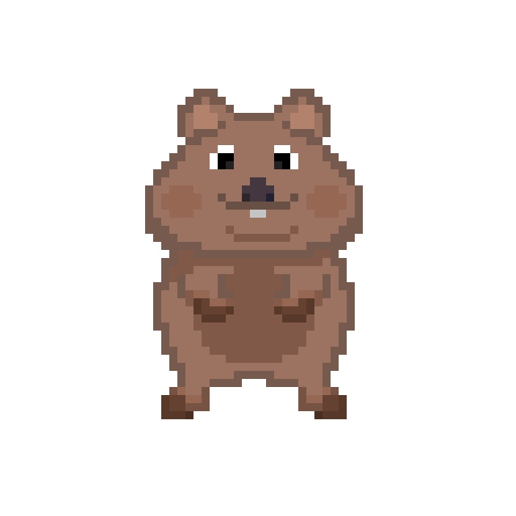
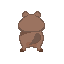
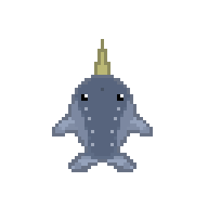
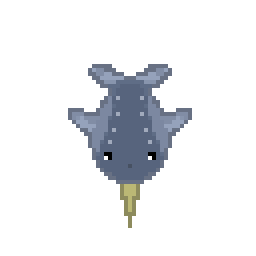

# Juego Grupo 6
Juego para la asignatura juegos en Red de la Universidad Rey Juan Carlos

## Integrantes
| Nombre    | Apellido | Correo                           | GitHub         |
|:---------:|:--------:|:--------------------------------|:--------------:|
| Lucía     | Andrés   | l.andres.2023@alumnos.urjc.es    | LuciaAndres    |
| Hugo      | García   | h.garciah.2023@alumnos.urjc.es   | hugogh28       |
| Lucas     | Joglar   | l.joglar.2023@alumnos.urjc.es    | UnstableLuca   |
| Sergio    | Ponce    | s.ponce.2023@alumnos.urjc.es     | Squeakyboy     |

## Resumen del Juego
Dos animales muy distintos, un quokka y un narval, se encuentran enfrentados en una lucha por la limpieza de sus ecosistemas, el objetivo del juego es simple, el jugador debe superar a su rival en puntuación, o dicho de otro modo, se pretende ser el que consiga recoger una mayor cantidad de basura para ser el que tenga ese mayor puntaje al final de la partida.

La pantalla estará dividida en dos zonas, la de la izquierda y terrestre pertenecerá al quokka, mientras que la de la derecha y acuática será la que pertenezca al narval. Para evitar confusiones habrá una división clara entre las dos zonas para evitar que los jugadores crean que pueden pasar al campo del otro. El movimiento que habrá será bastante similar al de otros muchos juegos "flash" que existen en Internet, ya que la intención es que el jugador pueda moverse de forma continua en dos dimensiones excluyendo toda dirección diagonal. No se pretende que se requiera una pausa notoria entre cada movimiento, ni que el quokka y el narval se muevan de forma ininterrumpida en la última dirección indicada tal y como se puede observar en juegos como el conocido **Snake**.

La vista será de tipo top-down para el quokka, mientras que para el narval será de tipo top, la necesidad de hacer estos dos tipos de perspectiva es por una simple decisión estética, ya que así el quokka y el narval tendrán un tamaño aparentemente similar, a diferencia de su tamaño real que dista mucho de ser parecido.
## Mecánicas
El juego constará de varias mecánicas pero las más básicas son la limpieza de basura y el tratar de perjudicar a tu rival. Complementando a estas mecánicas, se incluirá un temporizador, que determinará la duración de la partida.

### Limpieza
La limpieza es la mecánica más básica del juego y la que le da sentido a la partida, el objetivo es, que mediante aleatoriedad vaya apareciendo basura en las casillas de la zona de cada jugador, por lo que estos deberán rápidamente ir a limpiar dicha basura, lo que les agregará una puntuación en sus respectivos contadores. Dicha basura tendrá un tiempo límite de recogida, de modo que, si el jugador no la limpia a tiempo perderá la oportunidad de ganar puntos.

### Perjudicar al rival
Perjudicar al rival será otro de los objetivos que se tendrá en todo momento, de modo que, en el juego existirá la opción de arrojar basura al enemigo para ralentizarle. Esto se llevará acabo mediante la aparición de un objeto contaminante arrojadizo que pringará al rival y lo dejará en un estado de aturdimiento, al igual que la aparición de basura, la posibilidad de que este objeto se genere también será aleatoria.

### Temporizador
El antes mencionado temporizador será clave a la hora de determinar el tiempo límite de una partida y será el que finalmente determinará quién ha ganado la partida.

### Potenciadores de puntuación
Se incluirán objetos de aparición semialeatoria que potencien al jugador, de forma que este tenga mayores probabilidades de ganar la partida, el objetivo es que dichas ventajas las reciba mayoritariamente el jugador que se encuentre en mayor desventaja, de este modo se mantendrá una competitividad continua y se ayudará en todo momento a que aquel que tenga menor puntuación tenga al menos una posibilidad de recuperarse.

## Personajes

### Quokka
Uno de los personajes jugables que estarán en el juego es el quokka, este pequeño y contento animal estará en una zona terrestre con plantas autóctonas. 

### Narval
El otro personaje jugable será el narval, conocido mundialmente por su "cuerno" que le dota de ese apodo de unicornio de los mares, su zona será de aguas árticas.

## Ítems

### Basura
El ítem principal y más común que aparecerá durante las partidas será la basura, que será representada en forma de bolsas, recoger las mismas ofrecerá al jugador un incremento de cinco puntos en su marcador.

### Vertidos
Para dar un incremento a un mayor al puntaje de cada jugador habrá momentos en los que aparezcan vertidos de químicos o compuestos contaminantes en el campo de uno de los personajes. A diferencia de las bolsas de basura estos vertidos darán al jugador que lo recoja diez puntos para su puntaje, y también, a diferencia de las bolsas de basura estos aparecerán con menor frecuencia.

### Potenciadores
Como es mencionado en el apartado de mecánicas, existirán dos ítems que potenciarán al jugador. La necesidad de que no sean dos y no uno, es que para el quokka el potenciador serán unas bayas, mientras que para el narval será un pescado. El objetivo es que al recibir dicho potenciador, durante unos pocos segundos el jugador agraciado reciba el doble de puntuación al recoger basura. No obstante, si el jugador es atacado por su rival mediante la mecánica de "pringue", este perderá dicho potenciador aunque no recibirá la penalización antes mencionada.

Estos objetos tendrán aún menor probabilidad de aparición que los vertidos, aunque no solo dependerán de un porcentaje de aparición fijo, siempre se regirán por el puntaje de ambos jugadores, es decir, su probabilidad dependerá mayoritariamente de cómo fluya la partida.

### Pringue
Al igual que los potenciadores tendrá una probabilidad baja de aparecer, aunque a diferencia de estos, tendrá un funcionamiento mucho más fijo, es decir, no dependerá tanto del puntaje de los jugadores para efectuar su aparición.

Dicho pringue será lanzado al rival al ser recogido tal y como se haría con cualquier otro objeto.
