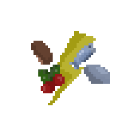
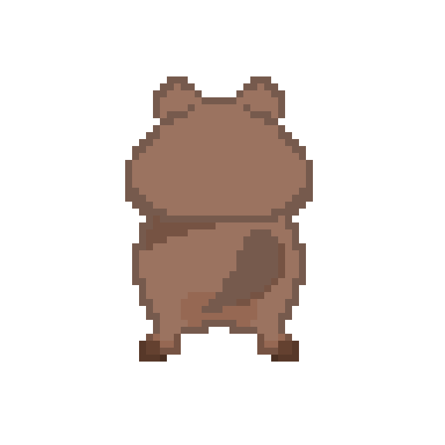

# BIOCLEANER
Juego para la asignatura juegos en Red de la Universidad Rey Juan Carlos

## Índice

1. [Integrantes](#Integrantes)
2. [Descripción de la temática](#Descripción-de-la-temática)
3. [GDD](#GDD)
   
    3.1. [Descripción del juego](#Descripción-del-juego)
   
    3.2. [Historia](#Historia)
   
    3.3. [Imagen y diseño visual](#Imagen-y-diseño-visual)
   
    3.4. [Controles](#Controles)

    3.5. [Mecánicas](#Mecánicas)
   
    3.6. [Personajes](#Personajes)
   
    3.7. [Items](#Ítems)
   
    3.8. [Sonido](#Sonido)

    3.9. [Narrativa](#Narrativa)

    3.10. [Marketing](#Marketing)

## Integrantes
|   Nombre  | Apellido |              Correo              | GitHub         |
|:---------:|:--------:|:--------------------------------:|:--------------:|
| Lucía     | Andrés   | l.andres.2023@alumnos.urjc.es    | LuciaAndres    |
| Hugo      | García   | h.garciah.2023@alumnos.urjc.es   | hugogh28       |
| Lucas     | Joglar   | l.joglar.2023@alumnos.urjc.es    | UnstableLuca   |
| Sergio    | Ponce    | s.ponce.2023@alumnos.urjc.es     | Squeakyboy     |

## Descripción de la temática
Dos animales muy distintos, un **quokka** y un **narval**, se encuentran enfrentados en una lucha por la limpieza de sus ecosistemas, el objetivo del juego es simple, el jugador debe superar a su rival en puntuación, o dicho de otro modo, se pretende ser el que consiga recoger una mayor cantidad de basura para ser el que tenga mayor puntuación al final de la partida.

GDD
=======

### Descripción del juego
La pantalla estará dividida en dos zonas, la de la izquierda y terrestre pertenecerá al quokka, mientras que la de la derecha y acuática será la que pertenezca al narval. Para evitar confusiones habrá una división clara entre las dos zonas para evitar que los jugadores crean que pueden pasar al campo del otro. El movimiento que habrá será bastante similar al de otros muchos juegos *Flash* que existen en Internet, ya que la intención es que el jugador pueda moverse de forma continua en dos dimensiones excluyendo toda dirección diagonal. No se pretende que se requiera una pausa notoria entre cada movimiento, ni que el quokka y el narval se muevan de forma ininterrumpida en la última dirección indicada tal y como se puede observar en juegos como el conocido **Snake**.

La vista será de tipo top-down para el quokka, mientras que para el narval será de tipo top, la necesidad de hacer estos dos tipos de perspectiva es por una simple decisión estética, ya que así el quokka y el narval tendrán un tamaño aparentemente similar, a diferencia de su tamaño real que dista mucho de ser parecido.

El juego es del género arcade competitivo 2D con subgéneros como party game y educativo ambiental. Está orientado para todo tipo de edades, pero es preferewnte para niños. Está pensado para jugarlo de forma online en una web.

### Diagrama de flujo

### Historia
Durante siglos, la Tierra fue un lugar donde la tierra y el mar convivían en armonía. Las raíces bebían del agua salada, y las olas dejaban en la arena los nutrientes que daban vida al bosque. Sin embargo, con el paso del tiempo, los restos de la civilización humana comenzaron a invadir ambos mundos. La basura se acumuló, el agua se enturbió y las hojas dejaron de brillar.

Entre los restos, dos animales lograron mantenerse en pie: 

 - El Quokka, habitante de la tierra firme, que perdió su hogar bajo montones de basura y hojas marchitas.   
 
 - El Narval, guardián del mar, que vio su océano volverse turbio y sin encanto.
   
Ambos tienen el mismo objetivo: limpiar el mundo que una vez los abrazó, pero, el dolor y la desconfianza los separan. Cada uno culpa al otro por el desastre, haciendo así que la tierra se convierta en un campo de batalla en el que ambos animales se enfrentarán en una carrera para demostrar quién le puede devolver la vida antes al planeta.Así, en lugar de cooperar, compiten. Cada uno recoge los restos de la Tierra, decididos a demostrar que su ecosistema es el más fuerte, el más puro, el más digno de renacer.

### Imagen y diseño visual
El juego tendrá un estilo visual de pixel art con una cámara en 2D. Para la parte marina se usarán colores azulados y morados, mientas que para la parte terrestrew se usarán colores más verdosos y marrones. Principalmente serán tonos vivos y llamativos, pero también nos encontraremos con algún color más apagado.

- #### Logotipo
  

- #### Bocetos

### Controles
Los controles para este juego son muy sencillos. Se utilizaran las teclas W,A,S,D para jugar con el Quokka y las flechas para jugar con el Narval. Para perjudiciar al rival se usará la Q en caso del Quokka y la N en caso del Narval.

### Mecánicas
El juego constará de varias mecánicas pero las más básicas son la limpieza de basura y el tratar de perjudicar a tu rival. Complementando a estas mecánicas, se incluirá un temporizador, que determinará la duración de la partida.

- #### Limpieza
  La limpieza es la mecánica más básica del juego y la que le da sentido a la partida, el objetivo es, que mediante aleatoriedad vaya apareciendo basura en las casillas de la zona de cada jugador, por lo que       estos deberán rápidamente ir a limpiar dicha basura, lo que les agregará una puntuación en sus respectivos contadores. Dicha basura tendrá un tiempo límite de recogida, de modo que, si el jugador no la limpia    a tiempo perderá la oportunidad de ganar puntos.

- #### Perjudicar al rival
  Perjudicar al rival será otro de los objetivos que se tendrá en todo momento, de modo que, en el juego existirá la opción de arrojar basura al enemigo para ralentizarle. Esto se llevará acabo mediante la         aparición de un objeto contaminante arrojadizo que pringará al rival y lo dejará en un estado de aturdimiento, al igual que la aparición de basura, la posibilidad de que este objeto se genere también será        aleatoria.

- #### Temporizador
  El antes mencionado temporizador será clave a la hora de determinar el tiempo límite de una partida y será el que finalmente determinará quién ha ganado la partida.

- #### Potenciadores de puntuación
  Se incluirán objetos de aparición semialeatoria que potencien al jugador, de forma que este tenga mayores probabilidades de ganar la partida, el objetivo es que dichas ventajas las reciba mayoritariamente el     jugador que se encuentre en mayor desventaja, de este modo se mantendrá una competitividad continua y se ayudará en todo momento a que aquel que tenga menor puntuación tenga al menos una posibilidad de   recuperarse.

### Personajes

- #### Quokka
  Uno de los personajes jugables que estarán en el juego es el quokka, este pequeño y contento animal estará en una zona terrestre con plantas autóctonas. 

- #### Narval
  El otro personaje jugable será el narval, conocido mundialmente por su "cuerno" que le dota de ese apodo de unicornio de los mares, su zona será de aguas árticas.

### Ítems

- #### Basura
  El ítem principal y más común que aparecerá durante las partidas será la basura, que será representada en forma de bolsas, recoger las mismas ofrecerá al jugador un incremento de cinco puntos en su marcador.

- #### Vertidos
  Para dar un incremento a un mayor al puntaje de cada jugador habrá momentos en los que aparezcan vertidos de químicos o compuestos contaminantes en el campo de uno de los personajes. A diferencia de las bolsas   de basura estos vertidos darán al jugador que lo recoja diez puntos para su puntaje, y también, a diferencia de las bolsas de basura estos aparecerán con menor frecuencia.

- #### Potenciadores
  Como es mencionado en el apartado de mecánicas, existirán dos ítems que potenciarán al jugador. La necesidad de que no sean dos y no uno, es que para el quokka el potenciador serán unas bayas, mientras que   para el narval será un pescado. El objetivo es que al recibir dicho potenciador, durante unos pocos segundos el jugador agraciado reciba el doble de puntuación al recoger basura. No obstante, si el jugador es   atacado por su rival mediante la mecánica de "pringue", este perderá dicho potenciador aunque no recibirá la penalización antes mencionada.

  Estos objetos tendrán aún menor probabilidad de aparición que los vertidos, aunque no solo dependerán de un porcentaje de aparición fijo, siempre se regirán por el puntaje de ambos jugadores, es decir, su probabilidad dependerá mayoritariamente de cómo fluya la partida.

 

- #### Pringue
  Al igual que los potenciadores tendrá una probabilidad baja de aparecer, aunque a diferencia de estos, tendrá un funcionamiento mucho más fijo, es decir, no dependerá tanto del puntaje de los jugadores para      efectuar su aparición.

  Dicho pringue será lanzado al rival al ser recogido tal y como se haría con cualquier otro objeto.

### Sonido

### Narrativa
La narrativa del juego es sencilla, ya que la historia que cuenta este juego se centra en eventos que podrían suceder en la vida real con el leve giro del enfrentamiento entre el quokka y el narval.

La historia que puede contar este juego se podría decir que es no más que un reflejo de la dura realidad que viven día a día miles de animales en el mundo, la contaminación de su hábitat. La decisión de centrar este juego en dos animales tan opuestos como un quokka y un narval es pues por la necesidad de que dicho reflejo de lo que es el mundo hoy en día llegue a nuestro público infantil, los dos animales protagonistas son conocidos mundialmente por el cariño que mucha gente les tiene, en el caso del quokka por parecer estar muy feliz todo el tiempo y en el caso del narval por ser conocido como el "unicornio de los mares". Así que, siendo ellos algo con lo que gran parte de nuestro público puede empatizar, son la mejor elección posible para que los niños entiendan la importancia de cuidar del hábitat de estos dos animales a través de un juego que, aunque incita a la competitivad también insta al mantenimiento del hogar de todos los animales, sin limitarse a los representados.

### Marketing
Se tomarán dentro del plan de marketing varias estrategias. Una de las principales será llegar a nuestro público a través de youtubers y streamers, ya que, al ser el juego orientado hacia un público más infantil, una de las mejores formas de llegar a este hoy en día es mediante las redes sociales. Junto a dicha estrategia, se promocionará el juego mediante anuncios in-game y en las redes sociales, ya que, al igual que nuestro público presta gran atención a gente influyente dentro de las redes, también suele moverse mucho en las redes y en juegos para móviles por lo que, una manera aún mejor de captarlo es no solo a través de sus creadores de contenido favoritos, sino también a través de su entretenimiento favorito. 

Junto con esas dos estrategias mencionadas, el equipo contará con varias redes sociales para no solo promocionar el juego mediante anuncios y patrocinios, sino también de forma directa a través de una cuenta oficial. El contenido que se publicará en dichas cuentas sería cuidadosamente elaborado para vender el producto de la mejor forma a nuestro público.
Al ser además este un juego similar a los que existen en Internet en formato web, una forma también idónea para promocionar el producto será a través de páginas web dedicadas o al menos relacionadas con contenido y/o juegos que suele visitar nuestro público.

Siguiendo este plan el equipo logrará llegar al público objetivo. A futuro se podrían implementar otras estrategias, aunque siempre de forma complementaria y tratando de priorizar en todo momento aquellas que se tiene conocimiento de su eficacia.

